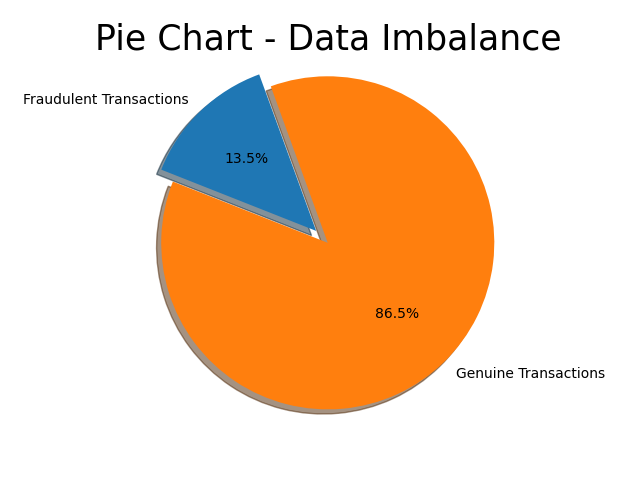

# FRAUDULANT TRANSACTION DETECTION (Group 24)

We are living in a digital economy where most of our transactions are performed online. Especially after the advent use of e-commerce applications, fraudulent transactions are on the rise. Hence, we need powerful techniques to identify fraudulent transactions.

The goal of this project is to develop a classifier using machine learning algorithms to help identify fraudulent transactions in real-time.

In this project, we will implement multiple supervised learnings algorithms to differentiate between fraudulent and genuine transactions and evaluate them.

# Research questions
<ol>
    <li>Can we differentiate between fraudulant and legitimate transactions?</li>
    <li>Which feature of the dataset impacts the classifier the most.</li>
</ol>

 

# Dataset: Fraudulent Transaction Detection
<b>Reference:</b> https://www.kaggle.com/datasets/sanskar457/fraud-transaction-detection

<ul>
    <li> Number of Datapoints: 1,048,576
    <li> Size of Dataset: 113 MB (.csv, Imbalanced)
</ul>

## Final Transactions.csv: 
    - TRANSACTION_ID (number)
    - TX_DATETIME (datetime)
    - CUSTOMER_ID (number)
    - TERMINAL_ID (number)
    - TX_AMOUNT (number)
    - TX_TIME_SECONDS (number)
    - TX_TIME_DAYS (number)
    - TX_FRAUD (boolean)
    - TX_FRAUD_SCENARIO (number)

# Data Preprocessing
### Data Cleaning
The dataset does not contain any null or invalid values, hence no data cleaning is required.

### Dataset Splitting
The dataset will be divided into Test, Train and Validation Dataset and k-fold cross validation will be used to evaluate the results while training.

### Data Imbalance
As illustrated in fig 1, there is a data imbalance. Fraudulent Transaction account to only 13.5% of the total transactions.
Therefore, exploration of various data pre-processing techniques will be done (Undersampling, Oversampling, Assigning class weights).

<em>Fig 1:</em> Illustrating the class imbalance in the dataset

 

# Class of Models: Supervised Classification

Output Classes:
<ol>
    <li> Fraudulent
    <li> Legitimate
</ol>

## Algorithm 1: Random Forest

Random forest consists of a large number of individual decision trees that operate as an ensemble.
Each individual tree in the random forest spits out a class prediction and the class with the most votes becomes our model's prediction
While some trees may be wrong, many other trees will be right, so as a group the trees are able to move in the correct direction.

Through this algorithm, we will try to determine the contribution of each feature to the final decision.

## Algorithm 2: K-Nearest Neighbors

In K-Nearest Neighbors (KNN), a new datapoint is classified based on similarity of its features with its neighboring datapoints.

For a given datapoint, the algorithm finds the distances between the point and its K-neighbours and votes for the category that has the highest frequency.

We will use Euclidean distance to measure distances.

## Algorithm 3: Decision Tree

Decision Tree uses a set of rules to make decisions similar to how humans make decisions.
In Decision Trees we use the dataset features to create yes/no questions. With this process we are organizing the data in a tree structure.

We will do hyperparameter tuning in order to optimize the results.

# Evaluation Metrics
We will use the below mentioned metrics to evaluate our results:

<ul>
    <li> Recall
    <li> Precision
    <li> F1-Score
    <li> Accuracy
    <li> Confusion Matrix
</ul >
